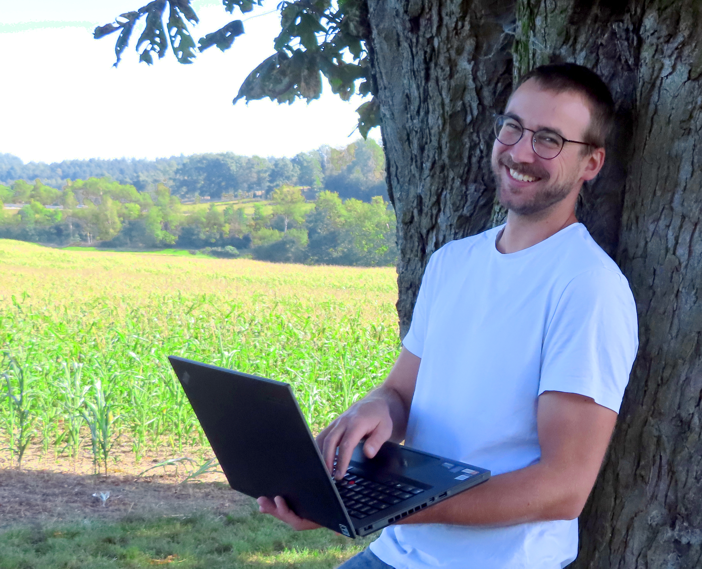
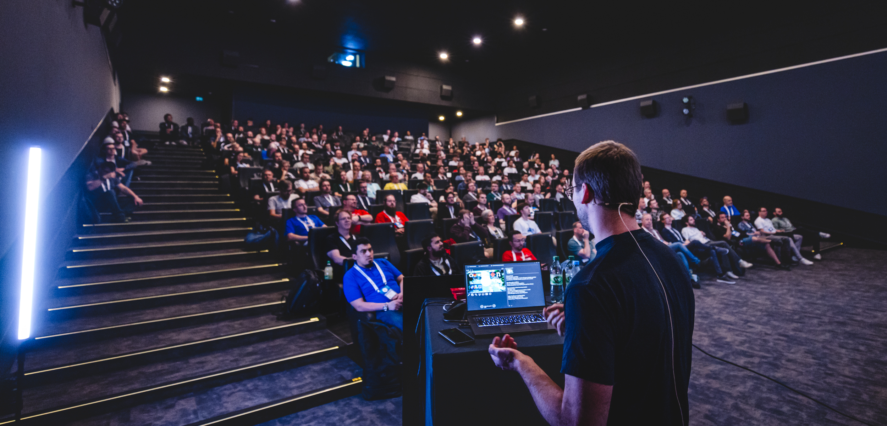

<h1 align="center">Hi, I'm Johannes 🌿👨‍💻</h1>

  

<em>
  Java Craftsman • Public Speaker • Father of three • Nature & Tech Enthusiast
</em>

---

### 🌱 About Me

- 👨‍💻 Senior Software Engineer at [XDEV Software GmbH](https://xdev.software)
- ☕ Passionate Java developer, with a previous life in .NET
- 🔄 Once helped systems run in *some of the most unexpected places*
- 💸 Experienced in fintech, building secure and scalable systems
- 📢 Speaker at JCON and Java User Groups (JUGs)
- 🧠 Creator of [XDEV Commit Cards](https://xdev.software/commit-cards) – because code reviews should be fun and thoughtful

  

---

### 🧩 What Drives Me

I believe software should be elegant, expressive, and purposeful — whether it's powering financial systems or sparking creativity in teams. I enjoy mentoring, speaking, and constantly evolving as a developer and human.

---

### 🔗 Let's Connect

- 💼 [LinkedIn](https://www.linkedin.com/in/johannesrabauer)
- 🐘 [Mastodon](https://mastodon.online/@rabauer)
- 🐦 [Twitter / X](https://twitter.com/JohannesRabauer)
- 🌐 [Bluesky](https://bsky.app/profile/johannesrabauer.bsky.social)
- 🧩 [Commit Cards](https://xdev.software/commit-cards)
- 🔍 [GitHub Contributions](https://github.com/JohannesRabauer?tab=repositories)
- 🌐 [XDEV Software GmbH](https://xdev.software)

---

🌳 Built between lines of code and forest walks. Profile photos captured in natural and conference habitats.
